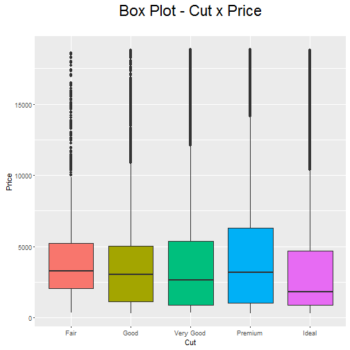

Diamonds Variables Explorer
========================================================
author: Deepak Vishwakarma
date: May 27,2016

Introduction
========================================================

For the Coursera Developing Data Products course project,
I decided to build a simple Shiny app.
This app uses the **diamonds** data set, which is available
with the **ggplot2** R package. It allows the user to
visualize two variable at a time: one numeric and one categorical.


The diamonds data set
========================================================

The diamonds data set has the following variables:

- price   - price in US dollars
- carat   - weight of the diamond 
- cut     - quality of the cut
- colour  - diamond colour, from J (worst) to D (best)  
- clarity - a measurement of how clear the diamond is
- x       - length in mm
- y       - width in mm
- z       - depth in mm
- depth   - total depth percentage = z / mean(x, y) = 2 * z / (x + y)
- table   - width of top of diamond relative to widest point

A glimpse at the diamonds data set
========================================================

```r
library(ggplot2)
head(diamonds[,c('price', 'carat', 'cut', 'color', 'clarity')])
```

```
  price carat       cut color clarity
1   326  0.23     Ideal     E     SI2
2   326  0.21   Premium     E     SI1
3   327  0.23      Good     E     VS1
4   334  0.29   Premium     I     VS2
5   335  0.31      Good     J     SI2
6   336  0.24 Very Good     J    VVS2
```

Example plot
========================================================



